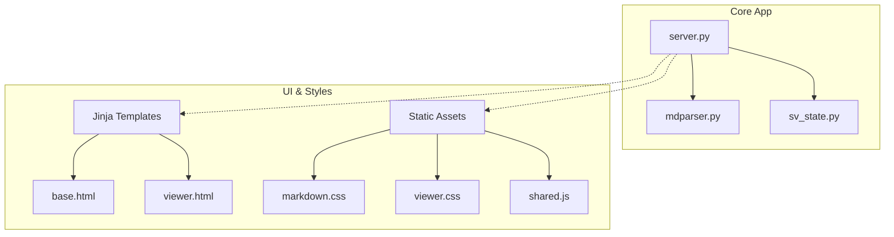

# MDV Reboot: Simplification & Core Planning

We are reverting **mdv** back to its core basics: a robust, lightweight, high-performance local markdown files viewer with rich theme configurability. 

---

## 1. Core Objectives

### 1.1 Robust, Light, and High-Performance MD Viewing
*   **Minimal Dependency Footprint:** Eliminated dynamic plugins, database connectors, and heavy external Python libraries (such as `beautifulsoup4`, `lxml`, `soupsieve`, and `typing_extensions`). Post-processing is split cleanly: HTML sanitization runs via a lightweight, built-in standard library `html.parser.HTMLParser` on the backend, while visual layout enhancements (like table/image wrapping, link text simplification, and tasklist style updates) are delegated to high-performance frontend JavaScript.
*   **Instant Load & Reload:** Ensure minimal overhead on application startup and rendering. In `lite_mode` (single file viewer), the load time should be virtually instantaneous.
*   **Direct File Representation:** Stream content straight from the local filesystem with automatic rendering using stable standard libraries (`markdown-it-py`, `Pygments` for syntax highlighting, and `KaTeX` for math blocks).
*   **Clean and Accessible UI:** Provide clear navigation via a dynamic sidebar Table of Contents, an directory explorer modal, and global content search.

### 1.2 Themes Configurability Deep Dive
We aim to make theme customizability seamless, lightweight, and robust. Below is a deep dive into the design options for adding custom themes:

#### Option A: Native CSS Theme Files (Recommended)
Users or developers define themes in individual `.css` files (e.g., `dracula.css`, `solarized.css`).
*   **How it works:**
    1. The server reads a user configuration directory or package resources (e.g., `src/mdv/themes/`) for all `.css` files.
    2. The filenames represent theme names. The server injects them as stylesheet links: `<link rel="stylesheet" href="/static/themes/{{ theme_name }}.css">`.
    3. Each file specifies theme rules inside a scoped class on `<body>`:
        ```css
        body.theme-dracula {
          --theme-bg: #282a36;
          --theme-text: #f8f8f2;
          --theme-primary: #bd93f9;
          --theme-border: #44475a;
        }
        ```
    4. Switching themes is instantaneous via JavaScript: `document.body.className = "theme-" + themeName;`.
*   **Pros:** Very high performance, natively supports CSS transitions, allows complex styling overrides (e.g. customized font weights, custom code block borders, Pygments syntax tokens) without constraints.
*   **Cons:** Users need basic CSS knowledge to define new themes.

#### Option B: JSON Theme Configurations
Users define theme variables in a key-value format inside a `themes.json` file.
*   **How it works:**
    1. A central configuration file defines the available themes:
        ```json
        {
          "dracula": {
            "name": "Dracula",
            "bg": "#282a36",
            "text": "#f8f8f2",
            "primary": "#bd93f9"
          }
        }
        ```
    2. The client fetches this JSON configuration and applies the values dynamically:
        ```javascript
        function applyJSONTheme(themeData) {
          Object.entries(themeData).forEach(([key, val]) => {
            document.documentElement.style.setProperty(`--theme-${key}`, val);
          });
        }
        ```
*   **Pros:** Very simple and declarative format for end-users to share or write.
*   **Cons:** Restrictive (can only customize pre-defined keys), and does not easily allow overrides of sub-components or advanced CSS styling rules (like shadow or transition variations).

#### Theme Custom Property Token Map
To keep layout implementation clean, the core CSS will only reference a standard token set:
```css
:root {
  /* Colors */
  --theme-bg: #ffffff;
  --theme-text: #24292f;
  --theme-primary: #0969da;
  --theme-border: #d0d7de;
  --theme-sidebar-bg: #f6f8fa;
  --theme-muted: #57606a;
  
  /* Code blocks & math */
  --theme-code-bg: #afb8c133;
  --theme-code-text: #24292f;
  
  /* Typography */
  --theme-font-sans: -apple-system, BlinkMacSystemFont, "Segoe UI", Helvetica, Arial, sans-serif;
  --theme-font-serif: "Noto Serif", Georgia, serif;
}
```

---

## 2. Refined Project Architecture

With the removal of the dynamic plugin loader and the external plugins, the project layout is streamlined:



### Streamlining Actions Taken
- **Removed Plugins:** The `plugins` package and loader logic have been completely deleted.
- **Removed CSV Viewer:** Deleted the CSV database connector, `csvviewer` templates, script handlers, styles, and command-line options.
- **Removed Worklog:** Cleanly excised the heavy worklog parsing logic, templates, and chart visualization components (including `Chart.js`).
- **Removed Drawing Tool:** Removed all drawing canvas templates, styling, scripts, and endpoints to keep focus strictly on local markdown document viewing.

---

## 3. Themes & Style Guide

To maintain a premium, state-of-the-art interface while keeping assets lightweight:

| Component | Style Approach | Implementation Status |
| :--- | :--- | :--- |
| **Typography** | Premium Noto Serif & System UI Sans-serif stacks | Implemented locally via web fonts in [base.html](file:///home/gnaagar/workspace/mdv/src/mdv/templates/base.html) |
| **Theme Toggles** | Responsive CSS custom variables and media query listeners | Implemented in [shared.js](file:///home/gnaagar/workspace/mdv/src/mdv/static/js/shared.js) |
| **Visual Accents** | Modern, premium hover micro-animations and layouts | Implemented in [viewer.css](file:///home/gnaagar/workspace/mdv/src/mdv/static/viewer.css) |

---

## 4. Next Steps & Development Roadmap

1. **Verify Base Performance:** Profile startup memory usage and rendering speeds on large markdown documents.
2. **Expand Theme Customization:** Add support for a simple configuration file (e.g., `theme.json` or custom CSS options) so users can define their own styling tokens.
3. **Optimized Search and Exploration:** Improve fuzzy search indices within `sv_state.py` for faster response times on large project directories.
