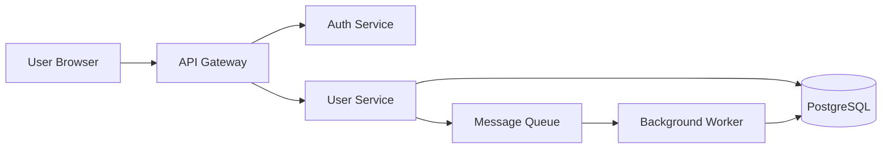
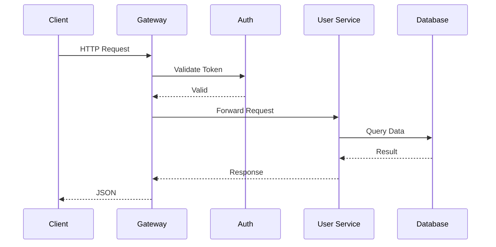
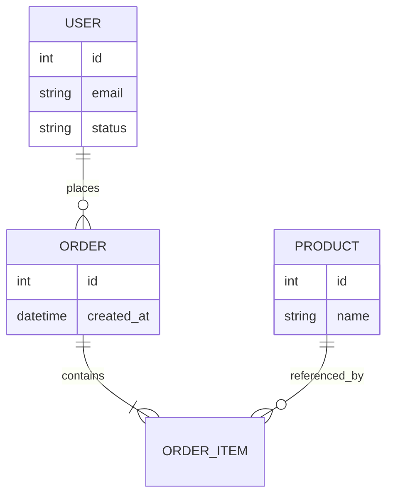
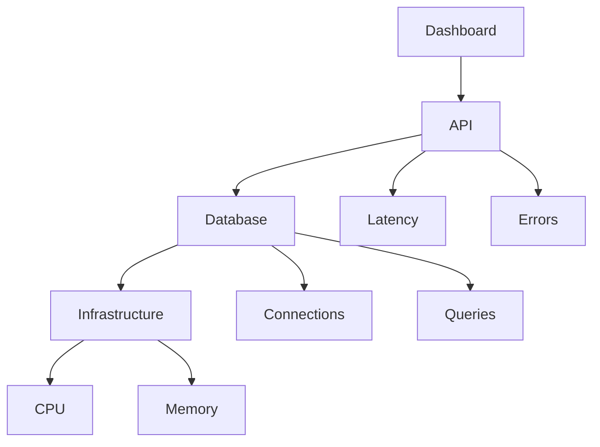
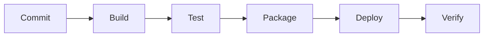

# Acme Cloud Platform Documentation

> Version: 3.2.1
>
> Last Updated: 2026-05-30
>
> Status: Draft

---

# Table of Contents

1. Introduction
2. Architecture Overview
3. Installation
4. Configuration
5. API Usage
6. Database Schema
7. Monitoring
8. Deployment
9. Troubleshooting
10. Appendix

---

# Introduction

The **Acme Cloud Platform** is a fictional distributed system used to demonstrate Markdown features.

It provides:

- User authentication
- Data processing
- Event streaming
- Analytics dashboards
- REST APIs
- Background jobs

Some important concepts:

| Term | Description |
|--------|-------------|
| Tenant | Logical customer boundary |
| Workspace | Collection of resources |
| Service | Deployable application component |
| Agent | Background processing worker |

Example inline code:

Use `acme-cli deploy` to deploy services.

Example text formatting:

- **Bold text**
- *Italic text*
- ***Bold + Italic***
- ~~Strikethrough~~
- `Monospace`
- <mark>Highlighted HTML</mark>

---

# Architecture Overview

## High-Level Components

The platform consists of several subsystems.

### Core Services

- API Gateway
- Authentication Service
- User Service
- Billing Service
- Notification Service

### Data Layer

- PostgreSQL
- Redis
- Object Storage
- Search Index

### Processing Layer

- Event Bus
- Stream Processors
- Background Workers

#### Notes

Each subsystem can scale independently.

---

## Architecture Diagram



---

## Request Lifecycle



---

# Installation

## Prerequisites

Before installing, ensure the following software is available:

1. Docker
2. Kubernetes
3. Helm
4. PostgreSQL
5. Git

### Supported Platforms

| Platform | Supported | Notes |
|-----------|-----------|---------|
| Linux | Yes | Recommended |
| macOS | Yes | Development only |
| Windows | Yes | WSL recommended |

---

## Download

Clone the repository:

```bash
git clone https://example.com/acme.git
cd acme
```

Install dependencies:

```bash
npm install
```

Build the project:

```bash
npm run build
```

---

# Configuration

## Environment Variables

| Variable | Required | Default |
|-----------|-----------|----------|
| PORT | No | 8080 |
| LOG_LEVEL | No | info |
| DB_HOST | Yes | - |
| DB_PORT | No | 5432 |
| DB_NAME | Yes | - |
| DB_USER | Yes | - |

### Example Configuration

```yaml
server:
  port: 8080

database:
  host: localhost
  port: 5432
  name: acme

logging:
  level: info
```

### JSON Example

```json
{
  "service": "user-api",
  "port": 8080,
  "metrics": true,
  "tracing": true
}
```

---

# API Usage

## Authentication

### Request

```http
POST /api/v1/auth/login
Content-Type: application/json

{
  "email": "user@example.com",
  "password": "secret"
}
```

### Response

```json
{
  "accessToken": "eyJhbGciOi...",
  "expiresIn": 3600
}
```

---

## User Endpoint

### Get User

```http
GET /api/v1/users/123
Authorization: Bearer <token>
```

### Sample Response

```json
{
  "id": 123,
  "name": "Jane Doe",
  "email": "jane@example.com",
  "status": "active"
}
```

---

## Error Format

```json
{
  "error": {
    "code": "USER_NOT_FOUND",
    "message": "Requested user does not exist"
  }
}
```

---

# Database Schema

## Entity Relationship Diagram



---

## Tables

### users

| Column | Type | Nullable |
|----------|----------|----------|
| id | bigint | No |
| email | varchar | No |
| status | varchar | No |
| created_at | timestamp | No |

### orders

| Column | Type | Nullable |
|----------|----------|----------|
| id | bigint | No |
| user_id | bigint | No |
| total | decimal | No |
| created_at | timestamp | No |

---

# Monitoring

## Metrics

The following metrics are collected:

- Request count
- Request duration
- Error rate
- Queue depth
- CPU usage
- Memory usage

### Example Prometheus Metric

```text
http_requests_total{service="api"} 12345
```

---

## Dashboard Layout



---

# Deployment

## CI/CD Pipeline



### Pipeline Steps

1. Checkout code
2. Run linting
3. Execute tests
4. Build artifacts
5. Publish images
6. Deploy cluster
7. Run smoke tests

---

## Kubernetes Deployment

```yaml
apiVersion: apps/v1
kind: Deployment

metadata:
  name: user-service

spec:
  replicas: 3

  selector:
    matchLabels:
      app: user-service

  template:
    metadata:
      labels:
        app: user-service

    spec:
      containers:
        - name: user-service
          image: acme/user-service:latest

          ports:
            - containerPort: 8080
```

---

# Troubleshooting

## Common Issues

### Service Not Starting

Possible causes:

- Missing environment variables
- Invalid configuration
- Database unavailable

Suggested actions:

- Verify logs
- Validate configuration
- Test database connectivity

### Database Connection Failure

```sql
SELECT now();
```

Check:

- Hostname
- Credentials
- Firewall
- Network routing

---

## Debug Checklist

- [ ] Configuration loaded
- [ ] Secrets available
- [ ] Database reachable
- [ ] Message queue reachable
- [ ] Metrics endpoint responding
- [ ] Health endpoint healthy

---

# Advanced Examples

## Nested Lists

1. Project
   1. Backend
      - API
      - Database
      - Queue
   2. Frontend
      - Web App
      - Mobile App
2. Operations
   - Monitoring
   - Logging
   - Security

---

## Blockquote Example

> Important:
>
> Production deployments must be approved by the release manager.
>
> Emergency fixes require post-deployment review.

---

## Definition-Style Content

Term: API

: Application Programming Interface

Term: SLA

: Service Level Agreement

---

## Inline HTML

<div>
    <strong>Custom HTML Block</strong>
    <br />
    This section tests raw HTML rendering.
</div>

---

## Escaping Characters

\*not italic\*

\# not a heading

\`not code\`

---

# Appendix

## Sample Directory Structure

```text
acme/
├── docs/
├── scripts/
├── src/
│   ├── api/
│   ├── auth/
│   ├── services/
│   └── workers/
├── tests/
├── package.json
└── README.md
```

---

## References

- https://example.com/docs
- https://example.com/api
- https://example.com/support

## Image Example


## Footnotes

This is a statement with a footnote.[^1]

Another statement.[^2]

[^1]: Example footnote content.

[^2]: Another footnote entry.

---

## Revision History

| Version | Date | Author | Notes |
|-----------|------------|------------|------------|
| 1.0.0 | 2025-01-01 | Team A | Initial release |
| 2.0.0 | 2025-06-15 | Team B | Major redesign |
| 3.0.0 | 2026-01-10 | Team C | Cloud migration |
| 3.2.1 | 2026-05-30 | Team D | Documentation update |

---

_End of Document_