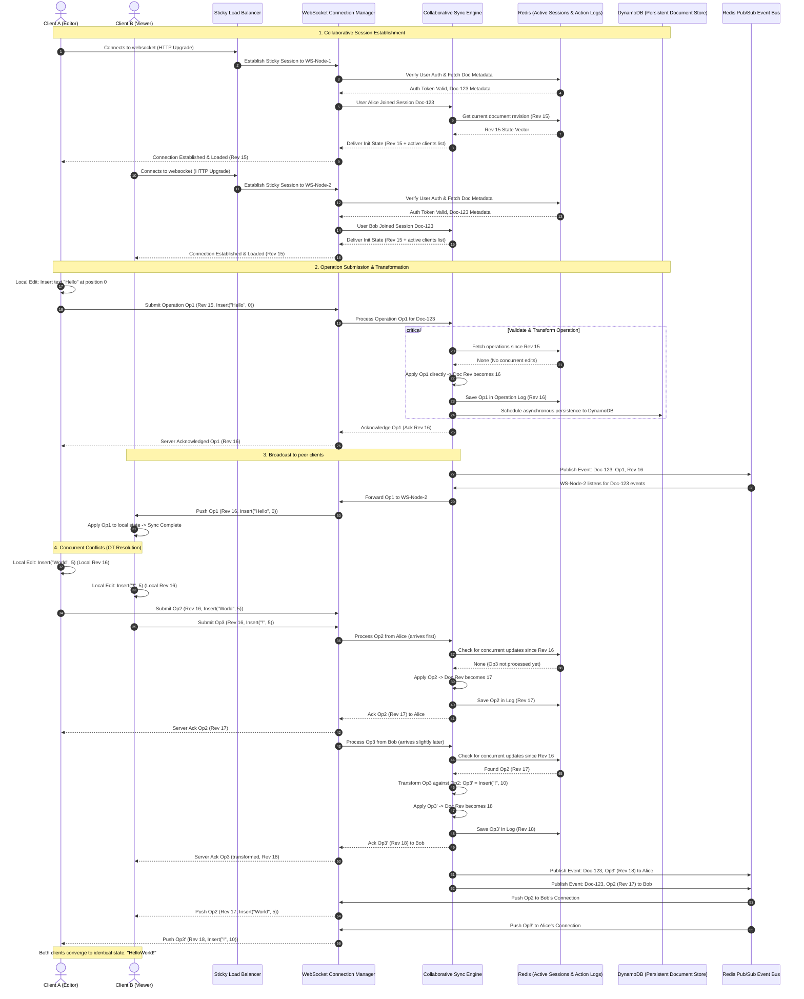
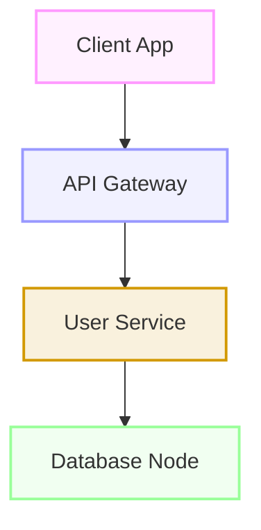

# Distributed Systems Architecture Showcase

This document showcases two large-scale system design architecture diagrams using **Mermaid.js** block rendering.

---

## 1. Microservices E-Commerce Platform Architecture

This diagram illustrates a complete high-level and detailed architecture of a modern, event-driven e-commerce platform. It details client connectivity, edge layers, gateway filters, core microservices, dedicated database systems, and an asynchronous Kafka event-bus message flow.

```mermaid
flowchart TB
    %% Client Layer
    subgraph Clients ["Client Applications"]
        Web["Web Application (React / Next.js)"]
        Mobile["Mobile App (iOS Swift / Android Kotlin)"]
        Partner["Partner Integration API Clients"]
    end

    %% Edge Layer
    subgraph Edge ["Edge Services & CDN"]
        DNS["Global Anycast DNS (AWS Route 53)"]
        CDN["CDN & Web Application Firewall (Cloudflare)"]
        LB["Application Load Balancer (Nginx / ALB)"]
    end

    %% Gateway Layer
    subgraph Gateway ["API Gateway (Kong / Envoy / Apigee)"]
        GW["API Gateway Router"]
        Auth["Auth Filter (JWT Validation / OAuth2)"]
        Rate["Rate Limiter (Token Bucket - Redis Backed)"]
    end

    %% Internal Microservices Layer
    subgraph Microservices ["Core Microservices"]
        IdentityService["Identity & User Service"]
        CatalogService["Catalog & Search Service"]
        CartService["Shopping Cart Service"]
        OrderService["Order Processing Service"]
        PaymentService["Payment Settlement Service"]
        InventoryService["Inventory Allocation Service"]
        NotificationService["Notification Delivery Service"]
    end

    %% Cache & Persistence Layer
    subgraph Persistence ["Data Store & Cache Layer"]
        UserDB[("PostgreSQL (Users DB - Primary/Replica)")]
        CatalogDB[("MongoDB (Document Store for Products)")]
        SearchIndex[("Elasticsearch (Catalog Search Index)")]
        CartCache[("Redis (Ephemeral Cart Cache Cluster)")]
        OrderDB[("PostgreSQL (Orders Transactional DB)")]
        InvDB[("PostgreSQL (Inventory Tracking DB)")]
    end

    %% Event-Driven Message Broker Layer
    subgraph Messaging ["Event-Driven Bus (Apache Kafka)"]
        KafkaHub["Kafka Cluster Event Broker"]
        subgraph KafkaTopics ["Kafka Event Topics"]
            OrderTopic["order-events-topic"]
            PaymentTopic["payment-events-topic"]
            InvTopic["inventory-events-topic"]
            NotifyTopic["notification-events-topic"]
        end
    end

    %% External Systems
    subgraph External ["External Third-Party APIs"]
        Stripe["Stripe Payments Gateway"]
        SendGrid["SendGrid Email Transporter"]
        Twilio["Twilio SMS gateway API"]
    end

    %% Infrastructure & Observability
    subgraph DevOps ["Observability & Monitoring Stack"]
        Grafana["Grafana Visualizer"]
        Prometheus["Prometheus Metrics Scraper"]
        Loki["Grafana Loki (Central Log Collector)"]
    end

    %% Edge & Client Connections
    Clients --> DNS
    DNS --> CDN
    CDN --> LB
    LB --> GW

    %% Gateway Filters
    GW --> Auth
    GW --> Rate
    Auth & Rate --> IdentityService

    %% Microservices Routing
    GW --> IdentityService
    GW --> CatalogService
    GW --> CartService
    GW --> OrderService

    %% Microservices to Persistence
    IdentityService --> UserDB
    CatalogService --> CatalogDB
    CatalogService --> SearchIndex
    CartService --> CartCache
    OrderService --> OrderDB
    InventoryService --> InvDB

    %% Event-Driven Communications
    OrderService -->|Publish 'Order Placed'| OrderTopic
    OrderTopic --> KafkaHub
    
    KafkaHub -->|Consume 'Order Placed'| PaymentService
    KafkaHub -->|Consume 'Order Placed'| InventoryService

    PaymentService -->|Process Transaction| Stripe
    PaymentService -->|Publish 'Payment Settled'| PaymentTopic
    PaymentTopic --> KafkaHub

    KafkaHub -->|Consume 'Payment Settled'| NotificationService
    KafkaHub -->|Consume 'Payment Settled'| OrderService
    
    InventoryService -->|Publish 'Stock Reserved'| InvTopic
    InvTopic --> KafkaHub

    NotificationService -->|Trigger Email| SendGrid
    NotificationService -->|Trigger SMS| Twilio

    %% Metrics & Log collection
    Microservices -.->|Push Logs| Loki
    Microservices -.->|Expose Metrics| Prometheus
    Prometheus --> Grafana
    Loki --> Grafana

    %% Styles and Themes
    classDef client fill:#ff99ff22,stroke:#ff99ff,stroke-width:2px;
    classDef gateway fill:#9999ff22,stroke:#9999ff,stroke-width:2px;
    classDef svc fill:#d2990022,stroke:#d29900,stroke-width:2px;
    classDef db fill:#99ff9922,stroke:#99ff99,stroke-width:2px;
    classDef messaging fill:#ff999922,stroke:#ff9999,stroke-width:2px;
    classDef external fill:transparent,stroke:#888,stroke-width:1.5px,stroke-dasharray: 5 5;


    class Web,Mobile,Partner client;
    class GW,Auth,Rate gateway;
    class IdentityService,CatalogService,CartService,OrderService,PaymentService,InventoryService,NotificationService svc;
    class UserDB,CatalogDB,SearchIndex,CartCache,OrderDB,InvDB db;
    class KafkaHub,OrderTopic,PaymentTopic,InvTopic,NotifyTopic messaging;
    class Stripe,SendGrid,Twilio external;
```

---

## 2. Real-Time Collaborative Document Syncing Sequence

This diagram details the sequence flow of a real-time collaborative editor (similar to Google Docs/Figma) running on WebSockets. It shows connection establishment, message broadcast via Redis Pub/Sub, and conflict resolution using Operational Transformation (OT).

---

## 3. Mermaid Color Choices Guidance (Light & Dark Compatible)

When styling complex diagram nodes that need to remain highly legible and aesthetically pleasing across both light and dark backgrounds, follow this palette selection guide:

### The Theme-Agnostic Palette Matrix

| Category / Component | Fill (Low Alpha / 13% opacity) | Stroke (Saturated Color) | Why it works |
| :--- | :--- | :--- | :--- |
| **Clients / Interfaces** | `#ff99ff22` (Magenta tint) | `#ff99ff` (Vibrant Pink) | Pops as a bright border in dark mode; retains clear tint in light mode. |
| **Gateways / Routing** | `#9999ff22` (Blue tint) | `#9999ff` (Vibrant Blue) | High contrast, calm blue borders are highly readable in light theme. |
| **Services / Core APIs** | `#d2990022` (Amber/Gold tint) | `#d29900` (Deep Amber Gold) | Uses warm gold instead of pure yellow to ensure stroke visibility against white background. |
| **Databases / Cache** | `#99ff9922` (Green tint) | `#99ff99` (Pastel Green) | Soft green is highly visible on dark backgrounds and readable on light themes. |
| **Queues / Event Hubs** | `#ff999922` (Red/Coral tint) | `#ff9999` (Vibrant Coral) | A warm coral-red that indicates transport boundaries without blending into white. |
| **External Systems** | `transparent` | `#888888` (Neutral Gray) | Simple neutral gray with a dashed style denotes boundaries outside the platform. |

### Styling Template Example

Use the following template code snippet directly inside flowcharts to category-styling nodes:

