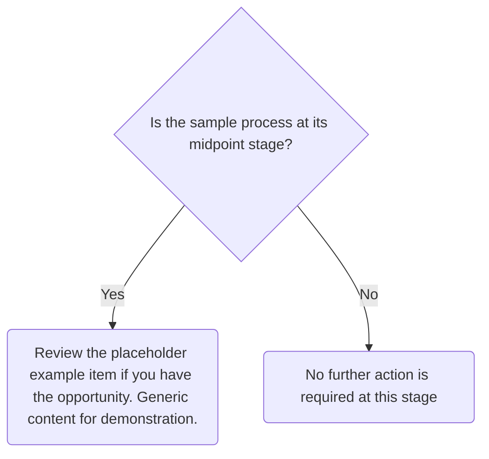

# Diagrams

```mermaid
flowchart TD
    A{Is the sample process at its midpoint stage?} -- Yes --> B(Review the placeholder example item if you have the opportunity. Generic content for demonstration.)
    A -- No --> C(No further action is required at this stage)
```

