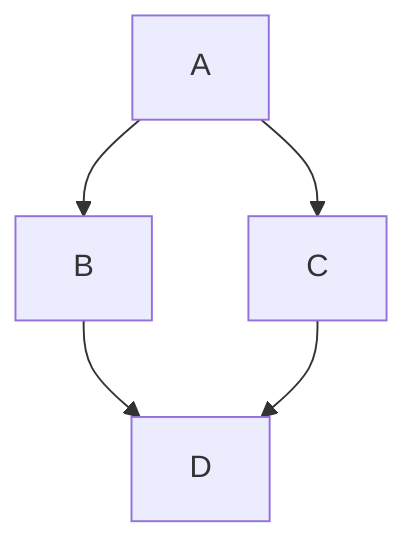

# General Markdown Features

## Headings

# Heading 1
## Heading 2
### Heading 3
#### Heading 4
##### Heading 5
###### Heading 6

## Paragraphs

This is a paragraph with some **bold** and *italic* text, as well as `inline code`.

## Lists

### Unordered List
- Item 1
- Item 2
  - Subitem 2.1
  - Subitem 2.2
- Item 3

### Ordered List
1. First item
2. Second item
   1. Subitem 2.1
   2. Subitem 2.2
3. Third item

## Blockquotes

> This is a blockquote.
> It can span multiple lines.

## Code Blocks

```
def hello_world():
    print("Hello, world!")
```

## Links

[GitHub](https://github.com)

## Images


## Tables

| Name   | Age |
|--------|-----|
| Alice  | 24  |
| Bob    | 19  |

## Horizontal Rule

---

## Task List

- [x] Task 1
- [ ] Task 2

Nested task list

- [ ] task 1
- [ ] task 2
  - [ ] subtask 1
  - [x] subtask 2
  

## Emoji

:smile: :rocket:

## Footnotes

Here is a footnote reference[^1].

[^1]: This is the footnote.

## Math

Inline math: $a^2 + b^2 = c^2$

Block math:

$$
\int_0^\infty e^{-x} dx = 1
$$

## Mermaid Diagram



## KaTeX Example

$$
\frac{a}{b} = c
$$
