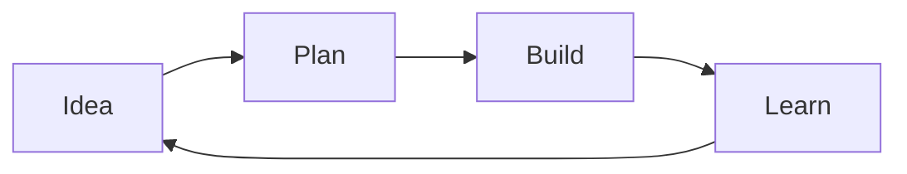

## Meet Orbit

### From idea to momentum

One focused workspace for planning, building, and sharing your best work.

---

## Everyday Markdown

Write naturally with **bold emphasis**, *italics*, `inline code`, and [useful links](https://example.com).

### A lower-level heading

Markdown is still the primary authoring language; slides only add document metadata, separators, and column directives.

---

## Lists and tasks

### What we need

- A clear problem statement
- A small, testable first release
  - One owner
  - One measurable outcome

1. Draft the proposal
2. Review it together
3. Ship the decision

- [x] Gather feedback
- [ ] Publish the plan

---

## A point of view

> Great presentations make one idea easy to carry forward.
>
> Use blockquotes for principles, evidence, or a memorable line.

---

## Code is first-class

```python
def launch(readiness: float) -> str:
    return "ship" if readiness >= 0.9 else "keep learning"
```

Use fenced code blocks with a language identifier for syntax highlighting.

---

## Data and math

| Signal | Target | This week |
| :--- | ---: | ---: |
| Activation | 60% | 64% |
| Weekly retention | 45% | 47% |

The familiar relationship: $a^2 + b^2 = c^2$.

$$
a^2 + b^2 = c^2
$$

---

## A Mermaid diagram



Mermaid blocks work just like they do in regular mdv documents.

---

## Built for flow

<!-- col-start 1:1 -->

### Plan

- Shape the outcome
- Keep context together
- Make the next step obvious

<!-- col-sep -->

### Ship

- Move from draft to delivery
- Share progress clearly
- Learn from every release

<!-- col-end -->

---

## Markdown in two columns

<!-- col-start 1:1 -->

### A quote

> Columns can hold the same Markdown blocks as a full-width slide.

Use **emphasis**, `inline code`, and ordinary paragraphs without a special syntax.

<!-- col-sep -->

### A compact table

| Choice | Result |
| --- | --- |
| Small step | Fast learning |
| Big bet | Bigger risk |

<!-- col-end -->

---

## Markdown in three columns

<!-- col-start 1:1:1 -->

### Plan

1. Name the outcome
2. Set a boundary

<!-- col-sep -->

### Build

```text
make it useful
```

<!-- col-sep -->

### Learn

- Measure the result
- Adjust the next step

<!-- col-end -->

---

## A two-row, three-column grid

<!-- col-start 1:1:1 -->

### Discover

Listen for the sharpest customer need.

<!-- col-sep -->

### Define

Write one measurable outcome.

<!-- col-sep -->

### Decide

Choose the smallest useful step.

<!-- col-end -->

<!-- col-start 1:1:1 -->

### Build

Keep the implementation focused.

<!-- col-sep -->

### Measure

Watch the signal that matters.

<!-- col-sep -->

### Learn

Use the result to guide the next cycle.

<!-- col-end -->

---

## A mixed row layout

<!-- col-start 1:1:1 -->

### First

Three concise observations.

<!-- col-sep -->

### Second

Each in its own card.

<!-- col-sep -->

### Third

All equally weighted.

<!-- col-end -->

<!-- col-start 1:1 -->

### Detail

Two larger areas work well for comparison.

<!-- col-sep -->

### Decision

Use the second row for the final trade-off.

<!-- col-end -->

<!-- col-start 1 -->

### One full-width conclusion

The final row can return to a single, uninterrupted thought.

<!-- col-end -->

---

## The result

### Less coordination. More creation.

**Orbit is available today.**
