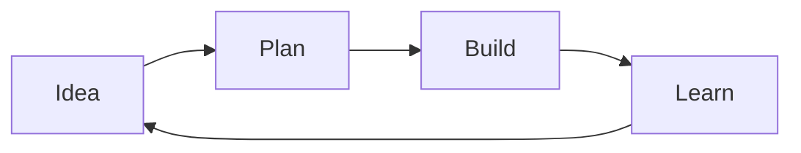

## Meet Orbit

### From idea to momentum

One focused workspace for planning, building, and sharing your best work.

<!-- speaker -->
Welcome everyone. Today we are introducing Orbit — a modern approach to collaborative planning and shipping.

---

## Everyday Markdown

Write naturally with **bold emphasis**, *italics*, `inline code`, and [useful links](https://example.com).

Highlight critical details using accent colors: <!-- color: blue -->**informative notes**<!-- /color -->, <!-- color: green -->*verified results*<!-- /color -->, <!-- color: yellow -->`warning flags`<!-- /color -->, or <!-- color: red -->**urgent blockers**<!-- /color -->.

### A lower-level heading

Markdown is still the primary authoring language; slides only add document metadata, separators, and column directives.

---

## Lists and tasks

### What we need

- A clear problem statement
- A small, testable first release
  - One owner
  - One measurable outcome

1. Draft the proposal
2. Review it together
3. Ship the decision

- [x] <!-- color: green -->**Gather feedback** (completed)<!-- /color -->
- [ ] <!-- color: yellow -->**Publish the plan** (in review)<!-- /color -->
- [ ] <!-- color: red -->*Security sign-off* (pending blocker)<!-- /color -->

---

## A point of view

<!-- quote: blue -->
> Great presentations make **one idea** easy to carry forward.
>
> Use blockquotes for principles, evidence, or a memorable line.

<!-- quote: yellow -->
> <!-- color: yellow -->
> **Guideline**: Keep slides focused; avoid clutter and preserve strong contrast. <!-- /color -->

---

## Code is first-class

```python
def launch(readiness: float) -> str:
    return "ship" if readiness >= 0.9 else "keep learning"
```

Use fenced code blocks with a language identifier for syntax highlighting.

---

## Data and math

| Signal | Target | This week |
| :--- | ---: | ---: |
| Activation | 60% | 64% |
| Weekly retention | 45% | 47% |

The familiar relationship: $a^2 + b^2 = c^2$.

$$
a^2 + b^2 = c^2
$$

---

## A Mermaid diagram



Mermaid blocks work just like they do in regular mdv documents.

---

## Built for flow

<!-- col-start 1:1 blue:green -->

### Plan

- Shape the outcome
- Keep context together
- Make the next step obvious

<!-- col-sep -->

### Ship

- Move from draft to delivery
- Share progress clearly
- <!-- color: green -->**Learn from every release**<!-- /color -->

<!-- col-end -->

<!-- quote: blue -->
> "Simplicity is prerequisite for reliability." — Edsger W. Dijkstra

<!-- speaker -->
- Emphasize that planning and shipping happen in the same unified workflow.
- Transition to the next slide demonstrating multi-column Markdown.

---

## Markdown in two columns

<!-- col-start 1:1 blue:green -->

### A quote

<!-- quote: blue -->
> Columns can hold the same Markdown blocks as a full-width slide.

Use **emphasis**, `inline code`, and ordinary paragraphs without a special syntax.

<!-- col-sep -->

### A compact table

| Choice | Result |
| --- | --- |
| Small step | Fast learning |
| Big bet | Bigger risk |

<!-- col-end -->

---

## Table as column card

When a column contains **only** a table, it fills the card completely — no padding, borders merge.

<!-- col-start 1:1 blue:green -->

| Signal | Target | This week |
| :--- | ---: | ---: |
| Activation | 60 % | 64 % |
| Retention | 45 % | 47 % |
| NPS | 50 | 54 |

<!-- col-sep -->

### Notes

The right column has normal content — the flush-fill only applies when the table is the **sole** element in the card.

<!-- col-end -->

---

## Markdown in three columns

<!-- col-start 1:1:1 blue:yellow:green -->

### Plan

1. Name the outcome
2. Set a boundary

<!-- col-sep -->

### Build

```text
make it useful
```

<!-- color: yellow -->
*Iterate quickly in small batches.*
<!-- /color -->

<!-- col-sep -->

### Learn

- Measure the result
- Adjust the next step
- <!-- color: green -->**Ship with confidence**<!-- /color -->

<!-- col-end -->

---

## A two-row, three-column grid

<!-- col-start 1:1:1 -->

### Discover

Listen for the sharpest customer need.

<!-- col-sep -->

### Define

Write one measurable outcome.

<!-- col-sep -->

### Decide

Choose the smallest useful step.

<!-- col-end -->

<!-- col-start 1:1:1 -->

### Build

Keep the implementation focused.

<!-- col-sep -->

### Measure

Watch the signal that matters.

<!-- col-sep -->

### Learn

Use the result to guide the next cycle.

<!-- col-end -->

---

## A mixed row layout

<!-- col-start 1:1:1 red:yellow:green -->

### Blocked

<!-- color: red -->
**High latency** on legacy database queries.
<!-- /color -->

<!-- col-sep -->

### In progress

<!-- color: yellow -->
Migrating cache tier to new cluster.
<!-- /color -->

<!-- col-sep -->

### Resolved

<!-- color: green -->
**Zero errors** recorded over the last 24 hours.
<!-- /color -->

<!-- col-end -->

<!-- col-start 1:1 blue:blue -->

### Detail

Two larger areas work well for comparison.

<!-- col-sep -->

### Decision

Use the second row for the final trade-off.

<!-- col-end -->

<!-- col-start 1 green -->

### Conclusion

<!-- quote: green -->
> **Orbit simplifies complex flows**: Plan, collaborate, and ship safely.

<!-- col-end -->

---

## The result

Less coordination. More creation.

<!-- color: green -->
**Orbit is available today.**
<!-- /color -->

<!-- speaker -->
Thank the team and open the floor for Q&A.
